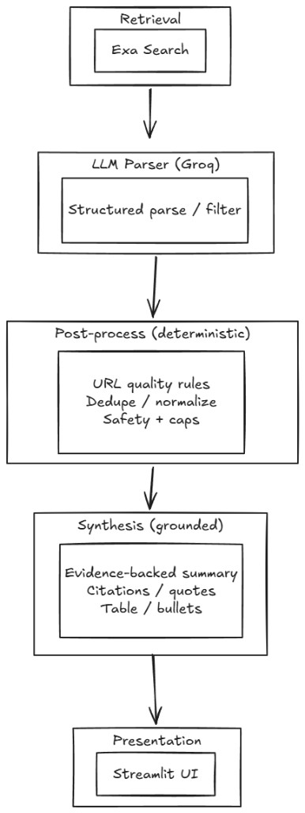

# MarketSense AI

Turn a startup idea into a structured competitor analysis and actionable market insights — in under 60 seconds.

## What it does

You describe an idea. MarketSense finds real competitors, extracts their product data, and synthesizes it into a comparison table and grounded strategic insights — including gap analysis and differentiation angles.

## Why it's different

Most AI research tools dump raw search results. MarketSense treats the LLM as a noisy parser and enforces structure at every layer:

- **LLM** extracts approximate structure from website text
- **Pydantic** enforces types and coerces malformed output
- **Post-process layer** applies deterministic rules: overrides sources, computes confidence from content signals, filters marketing claims from features
- **Synthesis layer** constrains the LLM to produce grounded insights — every insight must cite a company name or data point from the input

Output is stable and machine-readable across runs. No hallucinated gaps, no floating-point confidence values, no numbered feature arrays.

## Architecture

The system treats the LLM as a noisy parser and enforces structure through deterministic layers:



## Demo

[](https://youtu.be/LZMXcOeCCXU)

## Stack

- **Exa** — semantic company search + content extraction
- **Groq** (llama-3.1-8b-instant) — LLM parsing and synthesis
- **Pydantic** — schema validation and type coercion
- **Streamlit** — frontend

## Setup

```bash
git clone https://github.com/your-username/marketsense-ai
cd marketsense-ai
python -m venv venv && source venv/bin/activate  # Windows: venv\Scripts\activate
pip install -r requirements.txt
```

Copy `.env.example` to `.env` and add your API keys:

```
EXA_API_KEY=your_exa_key
GROQ_API_KEY=your_groq_key
```

```bash
streamlit run app.py
```

## Get API keys

- Exa: [exa.ai](https://exa.ai)
- Groq: [console.groq.com](https://console.groq.com)
