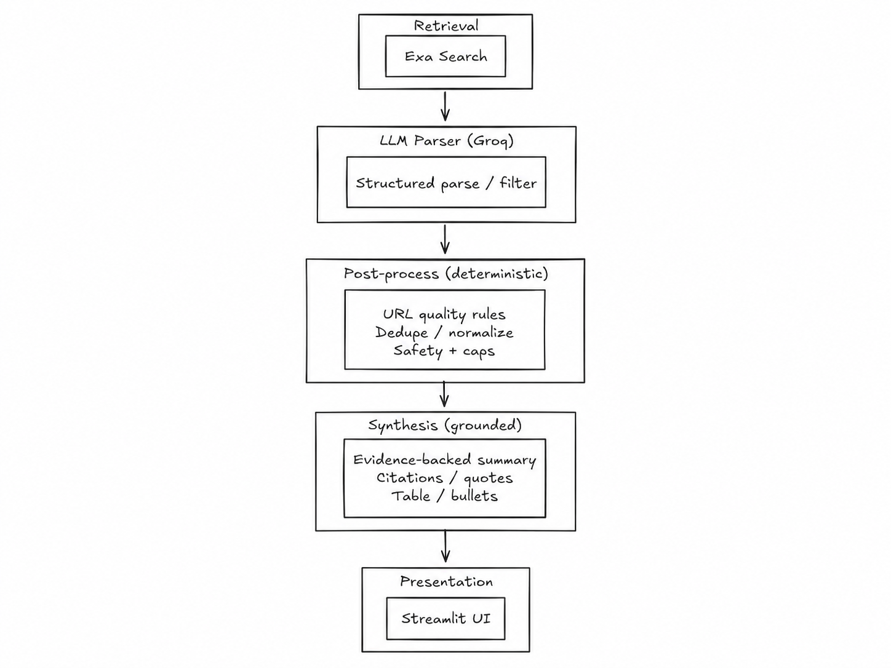

<div align="center">

# MarketSense AI

**Turn a startup idea into structured competitor intelligence in under 60 seconds.**

[](https://www.python.org/)
[](https://streamlit.io/)
[](https://console.groq.com/)
[](https://docs.pydantic.dev/)
[](https://exa.ai/)
[](LICENSE)

<br/>

[](https://youtu.be/LZMXcOeCCXU)

*Click to watch the demo*

</div>

---

## What It Does

You describe a startup idea. MarketSense finds real competitors, scrapes their websites, and synthesizes it all into a structured comparison table and grounded strategic insights - gap analysis, differentiation angles, and market patterns - with zero hallucination.

No dumping raw search results. No vague summaries. Just structured, machine-readable output you can act on.

---

## Why It's Different

Most AI research tools pipe search results straight into an LLM and return unstructured prose. MarketSense treats the LLM as a **noisy parser** and enforces correctness through deterministic layers:

| Layer | Responsibility |
|---|---|
| **Exa Search** | Semantic company discovery - categories over keywords |
| **LLM (Groq)** | Extracts approximate structure from raw website text |
| **Pydantic** | Enforces schema, coerces malformed output, rejects invalid data |
| **Post-process** | Overrides LLM confidence scores with signal-based computation; strips marketing claims from features |
| **Synthesis** | Constrains the LLM to grounded insights - every claim must cite a company name from the input data |

Output is **stable and machine-readable across runs.** No hallucinated gaps, no floating-point confidence values, no numbered feature arrays.

---

## Architecture

The pipeline is a series of layers - each one tightening the structure the next layer receives:



```
Idea (text)
    ↓
Exa Semantic Search           → 8 raw company results
    ↓
LLM Filter (Groq)             → 5 real companies (no blogs, news, directories)
    ↓
URL Quality Filter            → strips review sites, social profiles, noise paths
    ↓
Exa Content Extraction        → full website text per company
    ↓
LLM Analysis (Groq)           → structured JSON per company (name, features)
    ↓
Pydantic Validation           → type coercion, schema enforcement
    ↓
Post-Processing               → confidence recomputed from signals, features deduplicated
    ↓
Synthesis (Groq + Guardrails) → comparison table + grounded insights
    ↓
Streamlit UI                  → rendered output
```

---

## Pipeline in Detail

**1. Semantic Search** - Exa's `category: company` filter finds company pages instead of review sites or news articles. Highlights are extracted per result.

**2. LLM Filtering** - A strict Groq prompt selects at most 5 real companies from the results, discarding blogs, directories, and aggregators.

**3. URL Quality Guard** - Deterministic rules drop known noise domains (`capterra.com`, `g2.com`, `linkedin.com`, etc.) and generic paths (`/about`, `/contact`, `/login`).

**4. Content Extraction** - Exa fetches full page text for each remaining URL, capped at 5,000 characters per company.

**5. LLM Analysis + Pydantic** - Groq extracts a structured company profile (name, summary, target audience, features). Pydantic validates and coerces: float confidence becomes int, feature dicts become string arrays.

**6. Post-Processing** - The post-process layer overrides two LLM outputs deterministically:
- **Confidence** is recomputed from content depth, product-signal presence, and URL quality — never from the LLM.
- **Features** are filtered against a marketing-claim blocklist (`"up to"`, `"boost"`, `"guaranteed"`, etc.) and deduplicated by normalized key.

**7. Synthesis** - A constrained prompt forces the LLM to produce a markdown comparison table and 3–5 insights. Each insight must end with `(based on: [company name])` and make a concrete claim. A validation pass discards any insight under 10 words or lacking a company citation.

---

## Stack

| Tool | Role |
|---|---|
| [Exa](https://exa.ai) | Semantic company search + full-page content extraction |
| [Groq](https://console.groq.com) (`llama-3.1-8b-instant`) | LLM inference for filtering, analysis, and synthesis |
| [Pydantic v2](https://docs.pydantic.dev) | Schema validation and type coercion |
| [Streamlit](https://streamlit.io) | Frontend and UI |
| [python-dotenv](https://pypi.org/project/python-dotenv/) | Environment variable management |

---

## Project Structure

```
marketsense-ai/
├── app.py                  # Streamlit UI + pipeline orchestration
├── services/
│   ├── exa_client.py       # Exa search and content extraction
│   ├── groq_client.py      # Groq LLM calls + Pydantic validation
│   └── synthesis.py        # Market overview synthesis
├── utils/
│   ├── prompts.py          # LLM prompt builders
│   └── post_process.py     # Deterministic confidence + feature cleaning
├── assets/
│   └── architecture.png    # Architecture diagram
├── .env.example
├── requirements.txt
└── README.md
```

---

## Setup

**1. Clone and create a virtual environment**

```bash
git clone https://github.com/sudo-Harshk/marketsense-ai
cd marketsense-ai
python -m venv venv

# macOS/Linux
source venv/bin/activate

# Windows
venv\Scripts\activate
```

**2. Install dependencies**

```bash
pip install -r requirements.txt
```

**3. Configure API keys**

```bash
cp .env.example .env
```

Open `.env` and fill in your keys:

```env
EXA_API_KEY=your_exa_key_here
GROQ_API_KEY=your_groq_key_here
```

**4. Run the app**

```bash
streamlit run app.py
```

Open [http://localhost:8501](http://localhost:8501) in your browser.

---

## API Keys

| Service | Free Tier | Link |
|---|---|---|
| Exa | Yes - 1,000 searches/month | [exa.ai](https://exa.ai) |
| Groq | Yes - generous free tier | [console.groq.com](https://console.groq.com) |

Both services offer free tiers sufficient for development and testing.

---

<div align="center">

Built with [Exa](https://exa.ai) · [Groq](https://groq.com) · [Streamlit](https://streamlit.io)

</div>
